# Формулировка задания

Спроектировать базу данных для сервиса доставки здорового питания «Grow Food». База данных должна содержать информацию о пользователях, заказах, а также курьерах и поставщиках продуктов.

# Концептуальная модель базы данных

После проведения анализа предметной области была спроектирована следующая концептуальная модель:

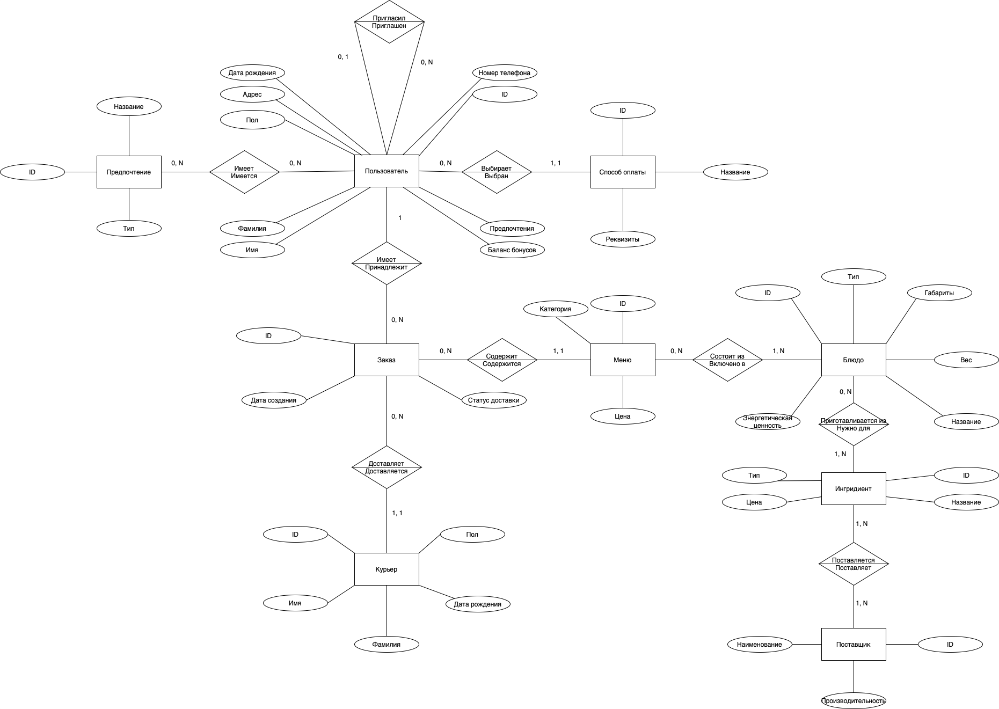

## Конкретизация предметной области

Необходимо создать систему, отражающую информацию о работе сервиса в сферах: работа с поставщиками, приготовление готовых блюд, составление меню, доставка до пользователей, оплата. Меню составляется на следующий месяц. База данных должна учитывать предпочтения пользователя по ингредиентам.

## Описание предметной области

Система рассчитана на работу с сотрудниками сервиса. Пользователи сервиса доступа к базе данных не имеют.

Каждому пользователю в его личном кабинете доступна информация о выбранных им предпочтениях, расписании меню на следующий месяц, количестве накопленных им баллов, а также предложении оформить заказ. 

Курьерам доступна информация о доставленных или доставляемых ими заказах: дата, адрес доставки, способ оплаты и сумма к оплате (при необходимости).

Сотрудники кухни могут воспользоваться информацией о ингредиентах, необходимых для того или иного блюда, а также о самих блюдах: их количестве, размере порции, калорийности.

## Описание атрибутов

В процессе анализа были выделены следующие атрибуты, название и описание которых приведены ниже в таблице:

|        Название атрибута        | Описание атрибута                                                                                               |
| :-----------------------------: | --------------------------------------------------------------------------------------------------------------- |
|               id                | Уникальный идентификатор. Есть у каждого объекта                                                                |
|     Имя, фамилия, отчество      | Имя, фамилия и отчество пользователей сервиса или курьеров, доставляющих заказы                                 |
|               пол               | Пол пользователя                                                                                                |
|          Дата рождения          | Дата рождения пользователя или курьера                                                                          |
|         Номер телефона          | Российский номер телефона пользователя                                                                          |
|  id пригласившего пользователя  | `id` пользователя, который пригласил данного в сервис                                                           |
|       Количество бонусов        | Количество бонусов, находящихся на счету у данного пользователя                                                 |
|              Адрес              | Адрес пользователя для доставки в пределах города Москва                                                        |
|              Дата               | Дата создания заказа, дата для меню, где указываются доступные наборы блюд на день                              |
|          Название меню          | Название для меню. Например "Похудение"                                                                         |
|              Цена               | Розничная цена меню, закупочная цена ингредиентов                                                               |
|            Коллораж             | Количество колорий, на которое рассчитано данное меню                                                           |
|               Тип               | Тип блюда или тип ингридиента                                                                                   |
|               Вес               | Вес блюда в граммах                                                                                             |
|       Название поставщика       | Название компании или иное имя для организации, поставляющей ингредиенты                                        |
|         Продуктивность          | Количество килограмм ингредиента в месяц, которое может быть закуплено у поставщика                             |
| Название категории предпочтений | Название для каждой категории предпочтений из некоторого перечня                                                |
|      Название предпочтения      | Название для сущности "Предпочтение", которое выбирает пользователь, чтобы потреблять еду, более ему подходящую |
|     Название способа оплаты     | Название для способа оплаты                                                                                     |
|            Реквизиты            | Необходимые для данного способа оплаты данные. Например, номер карты, номер счёта или номер чека                |

# Логическое проектирование

Следующим шагом на основе КМПО была разработана логическая модель базы
данных, представленная ниже:


Для соблюдения третьей нормальной формы информация об оплате и категории предпочтений были вынесены в отдельные таблицы. Также отмечены связи "один ко многим".

Ключевую роль играют таблицы "Пользователь" и "Заказ", так как в них включены основные сущности сервиса доставки здорового питания: курьеры, предпочтения, оплата и меню.

Таким образом, все таблицы базы данных находятся в третьей нормальной форме.

# Физическое проектирование

В качестве СУБД для реализации разработанной базы данных была выбрана
PostgreSQL. В связи с проведённым анализом предметной области была проработана
следующая физическая схема БД. Она представлена на следующем рисунке:

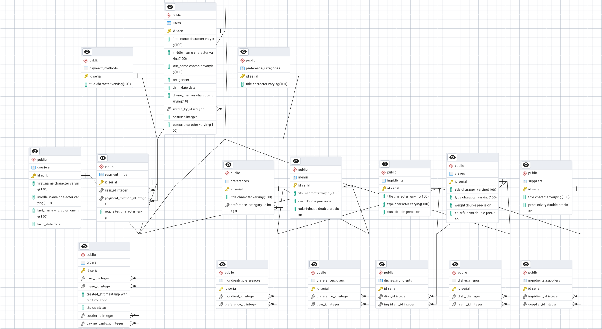

## Создание таблиц

Ниже представлен код на языке `Python` для создания таблиц базы данных. В качестве `ORM` использована библиотека `SQLAlchemy`.

- Код для создания таблицы "users":

```python
class Gender(enum.Enum):
    male = "male"
    female = "female"


class Users(Base):
    __tablename__ = "users"

    id: Mapped[intpk]
    first_name: Mapped[str_100]
    middle_name: Mapped[str_100 | None]
    last_name: Mapped[str_100]
    sex: Mapped[Gender | None]
    birth_date: Mapped[datetime.date]
    phone_number: Mapped[phone_number]
    invited_by_id: Mapped[int | None] = mapped_column(
        ForeignKey("users.id", ondelete="SET NULL")
    )
    bonuses: Mapped[int] = mapped_column(server_default=text("0"))
    address: Mapped[str_100 | None]
```

- Код для создания таблицы "payment_methods":

```python
class Payment_methods(Base):
    __tablename__ = "payment_methods"
    id: Mapped[intpk]
    title: Mapped[str_100]
    require_requisites: Mapped[bool]
```

- Код для создания таблицы "payment_infos":

```python
class Payment_infos(Base):
    __tablename__ = "payment_infos"
    id: Mapped[intpk]
    user_id: Mapped[int | None] = mapped_column(
        ForeignKey("users.id", ondelete="CASCADE")
    )
    payment_method_id: Mapped[int | None] = mapped_column(
        ForeignKey("payment_methods.id", ondelete="CASCADE", server_default="1")
    )
    requisites: Mapped[str] = mapped_column(nullable=True)
```

- Код для создания таблицы "preference_categories":

```python
class Preference_categories(Base):
    __tablename__ = "preference_categories"
    id: Mapped[intpk]
    title: Mapped[str_100]
```

- Код для создания таблицы "preferences":

```python
class Preferences(Base):
    __tablename__ = "preferences"
    id: Mapped[intpk]
    title: Mapped[str_100]
    preference_category_id: Mapped[int] = mapped_column(ForeignKey("preference_categories.id", ondelete="CASCADE"))
```

- Код для создания таблицы "couriers":

```python
class Couriers(Base):
    __tablename__ = "couriers"

    id: Mapped[intpk]
    first_name: Mapped[str_100]
    middle_name: Mapped[str_100 | None]
    last_name: Mapped[str_100]
    birth_date: Mapped[datetime.date]
```

- Код для создания таблицы "menus":

```python
class Menus(Base):
    __tablename__ = "menus"

    id: Mapped[intpk]
    title: Mapped[str_100]
    cost: Mapped[float]
    count_dishes: Mapped[int]
    colorfulness: Mapped[float]
```

- Код для создания таблицы "orders":

```python
class Status(enum.Enum):
    new = "new"
    in_delivery = "in_delivery"
    delivered = "delivered"
    cancelled = "cancelled"
    returned = "returned"

class Orders(Base):
    __tablename__ = "orders"

    id: Mapped[intpk]
    user_id: Mapped[int] = mapped_column(ForeignKey("users.id", ondelete="CASCADE"))
    menu_id: Mapped[int | None] = mapped_column(
        ForeignKey("menus.id", ondelete="SET NULL")
    )
    created_at: Mapped[datetime.datetime] = mapped_column(server_default=text("now()"))
    status: Mapped[Status] = mapped_column(server_default=text("'new'"))
    courier_id: Mapped[int | None] = mapped_column(
        ForeignKey("couriers.id", ondelete="SET NULL")
    )
    payment_info_id: Mapped[int | None] = mapped_column(
        ForeignKey("payment_infos.id", ondelete="SET NULL")
    )
```

- Код для создания таблицы "dishes":

```python
class Dishes(Base):
    __tablename__ = "dishes"

    id: Mapped[intpk]
    title: Mapped[str_100]
    type: Mapped[str_100]
    weight: Mapped[float]
    colorfulness: Mapped[float]
```

- Код для создания таблицы "dishes_menus":

```python
class Dishes_Menus(Base):
    __tablename__ = "dishes_menus"

    id: Mapped[intpk]
    dish_id: Mapped[int] = mapped_column(ForeignKey("dishes.id", ondelete="CASCADE"))
    menu_id: Mapped[int] = mapped_column(ForeignKey("menus.id", ondelete="CASCADE"))
    date: Mapped[datetime.date] = mapped_column(server_default="now()")
```

- Код для создания таблицы "ingredients":

```python
class Ingredients(Base):
    __tablename__ = "ingredients"
    id: Mapped[intpk]
    title: Mapped[str_100]
    type: Mapped[str_100]
    cost: Mapped[float]
```

- Код для создания таблицы "dishes_ingredients":

```python
class Dishes_Ingredients(Base):
    __tablename__ = "dishes_ingredients"

    id: Mapped[intpk]
    dish_id: Mapped[int] = mapped_column(ForeignKey("dishes.id", ondelete="CASCADE"))
    ingredient_id: Mapped[int] = mapped_column(
        ForeignKey("ingredients.id", ondelete="CASCADE")
    )
```

- Код для создания таблицы "suppliers":

```python
class Suppliers(Base):
    __tablename__ = "suppliers"

    id: Mapped[intpk]
    title: Mapped[str_100]
    productivity: Mapped[float]
```

- Код для создания таблицы "ingredients_suppliers":

```python
class Ingredients_Suppliers(Base):
    __tablename__ = "ingredients_suppliers"

    id: Mapped[intpk]
    ingredient_id: Mapped[int] = mapped_column(
        ForeignKey("ingredients.id", ondelete="CASCADE")
    )
    supplier_id: Mapped[int] = mapped_column(
        ForeignKey("suppliers.id", ondelete="CASCADE")
    )
```

- Код для создания таблицы "ingredients_preferences":

```python
class Ingredients_Preferences(Base):
    __tablename__ = "ingredients_preferences"
    id: Mapped[intpk]
    ingredient_id: Mapped[int] = mapped_column(
        ForeignKey("ingredients.id", ondelete="CASCADE")
    )
    preference_id: Mapped[int] = mapped_column(
        ForeignKey("preferences.id", ondelete="CASCADE")
    )
```

## Заполнение базы данных

Заполнение базы данных производилось при помощи библиотек `SQLAlchemy`, `Faker` и пакета `random` для языка программирования `Python`.

### Подготовка данных

Были подготовлены данные о блюдах, ингредиентах, а также связях между ними. Подготовлены данные о связи ингредиентов с предпочтениями пользователей. Данные записывались в формате `CSV`. 

Данные о меню, способах оплаты, категориях предпочтений и самих предпочтениях были взяты с оригинального сайта сервиса доставки здорового питания "Grow Food".

Придуманы функции для корректной генерации имён в зависимости от пола, генерации дат рождения. Добавлены алгоритмы для реалистичного заполнения данных о заказах, выбранных предпочтениях, бонусах, информации о платежах, расписание меню на следующий месяц.

### Программа заполнения базы данных

- Код, заполняющий таблицу "users":

```python
fake = Faker("ru_RU")


def generate_phone_number():
    """Форматирует номер телефона в виде 10 цифр без кода страны."""
    return fake.numerify("9#########")


def generate_name_by_gender(gender):
    """Генерация имени, отчества и фамилии в зависимости от пола."""
    if gender == models.Gender.male:
        first_name = fake.first_name_male()
        middle_name = fake.middle_name_male()
        last_name = fake.last_name_male()
    else:
        first_name = fake.first_name_female()
        middle_name = fake.middle_name_female()
        last_name = fake.last_name_female()
    return first_name, middle_name, last_name


def generate_birth_date(min_age=18, max_age=80):
    """Генерация даты рождения в диапазоне от min_age до max_age лет назад."""
    today = datetime.date.today()
    start_date = today.replace(year=today.year - max_age)
    end_date = today.replace(year=today.year - min_age)
    return fake.date_between(start_date=start_date, end_date=end_date)


def seed_users(n=50):
    users = []
    for _ in range(n):
        sex = random.choice([models.Gender.male, models.Gender.female])
        first_name, middle_name, last_name = generate_name_by_gender(sex)

        user = models.Users(
            first_name=first_name,
            middle_name=middle_name,
            last_name=last_name,
            sex=sex,
            birth_date=generate_birth_date(),
            phone_number=generate_phone_number(),
            address=fake.street_address() if random.random() < 0.3 else None,
            bonuses=0,
        )
        users.append(user)

    session.bulk_save_objects(users)
    session.commit()

    all_users = session.query(models.Users).all()
    for user in all_users:
        if random.random() < 0.3:  # 30% пользователей будут иметь "пригласившего"
            user.invited_by_id = random.choice(all_users).id
    session.commit()
```

- Код, заполняющий таблицу "payment_methods":

```python
def seed_payment_methods():
    payment_methods = [
        models.Payment_methods(title="Наличные курьеру", require_requisites=False),
        models.Payment_methods(title="Карта курьеру", require_requisites=True),
        models.Payment_methods(title="Карта", require_requisites=True),
        models.Payment_methods(title="Яндекс.Сплит", require_requisites=True),
    ]

    session.bulk_save_objects(payment_methods)
    session.commit()
```

- Код, заполняющий таблицу "payment_infos":

```python
fake = Faker("ru_RU")

def seed_payment_infos():
    users = session.query(models.Users).all()
    payment_methods = session.query(models.Payment_methods).all()
    
    payment_infos = []
    for user in users:
        for payment_method in payment_methods:
            if random.random() < 0.5:
                continue
            payment_info = models.Payment_infos(
                user_id=user.id,
                payment_method_id=payment_method.id,
                requisites=fake.credit_card_number() if payment_method.require_requisites else None
            )
            payment_infos.append(payment_info)
    
    session.bulk_save_objects(payment_infos)
    session.commit()
```

- Код, заполняющий таблицу "preference_categories":

```python
def seed_preference_categories():
    categories = [
        "аллергены",
        "десерты, выпечка, сахар",
        "мясо, рыба",
        "овощи, лук, чеснок",
        "гарниры, каши"
    ]
    session.bulk_save_objects([Preference_categories(title=title) for title in categories])
    session.commit()
```

- Код, заполняющий таблицу "preferences":

```python
def seed_preferences():
    preferences = [
        {"title": "Без творога", "preference_category_id": 1},
        {"title": "Без орехов", "preference_category_id": 1},
        {"title": "Без меда", "preference_category_id": 1},
        {"title": "Без морепродуктов", "preference_category_id": 1},
        {"title": "Без горчицы", "preference_category_id": 1},
        {"title": "Без шоколада", "preference_category_id": 1},
        
        {"title": "Без десертов", "preference_category_id": 2},
        {"title": "Без выпечки", "preference_category_id": 2},
        {"title": "Без сэндвичей и круассанов", "preference_category_id": 2},
        {"title": "Без белого сахара", "preference_category_id": 2},
        
        {"title": "Без свинины и ветчины", "preference_category_id": 3},
        {"title": "Без красного мяса", "preference_category_id": 3},
        {"title": "Без рыбы", "preference_category_id": 3},
        {"title": "Без мяса и птицы", "preference_category_id": 3},
        
        {"title": "Без сельдерея", "preference_category_id": 4},
        {"title": "Без грибов", "preference_category_id": 4},
        {"title": "Без стручковой фасоли", "preference_category_id": 4},
        {"title": "Без брокколи", "preference_category_id": 4},
        {"title": "Без кабачков", "preference_category_id": 4},
        {"title": "Без лука", "preference_category_id": 4},
        {"title": "Без чеснока", "preference_category_id": 4},
        
        {"title": "Без нута", "preference_category_id": 5},
        {"title": "Без булгура", "preference_category_id": 5},
        {"title": "Без кускуса", "preference_category_id": 5},
        {"title": "Без гречки", "preference_category_id": 5},
        {"title": "Без молочных каш", "preference_category_id": 5}
    ]

    session.bulk_insert_mappings(Preferences, preferences)
    session.commit()
```

- Код, заполняющий таблицу "couriers":

```python
fake = Faker("ru_RU")


def generate_courier_name():
    first_name = fake.first_name_male()
    middle_name = fake.middle_name_male()
    last_name = fake.last_name_male()
    return first_name, middle_name, last_name


def generate_birth_date(min_age=18, max_age=60):
    today = datetime.date.today()
    start_date = today.replace(year=today.year - max_age)
    end_date = today.replace(year=today.year - min_age)
    return fake.date_between(start_date=start_date, end_date=end_date)


def seed_couriers(n=50):
    couriers = []
    for _ in range(n):
        first_name, middle_name, last_name = generate_courier_name()

        courier = models.Couriers(
            first_name=first_name,
            middle_name=middle_name,
            last_name=last_name,
            birth_date=generate_birth_date(),
        )
        couriers.append(courier)

    session.bulk_save_objects(couriers)
    session.commit()
```

- Код, заполняющий таблицу "menus":

```python
def seed_menus():
    menus = [
        models.Menus(title="Похудение", cost=700, count_dishes=3, colorfulness=1000),
        models.Menus(title="Баланс", cost=850, count_dishes=4, colorfulness=1500),
        models.Menus(title="Набор", cost=1000, count_dishes=5, colorfulness=2000),
    ]

    session.bulk_save_objects(menus)
    session.commit()
```

- Код, заполняющий таблицу "orders":

```python
fake = Faker("ru_RU")


def generate_order_created_time(duration):
    now = datetime.datetime.now()
    start_time = now - datetime.timedelta(days=duration)
    return fake.date_time_between(start_date=start_time, end_date=now)


def generate_order_status(created_time):
    now = datetime.datetime.now()
    if now - created_time <= datetime.timedelta(days=1):
        status_weights = {
            models.Status.new: 0.5,
            models.Status.in_delivery: 0.5,
        }
        status = random.choices(
            list(status_weights.keys()), list(status_weights.values()), k=1
        )[0]
    elif datetime.timedelta(days=1) < now - created_time <= datetime.timedelta(days=3):
        status_weights = {models.Status.in_delivery: 0.1, models.Status.delivered: 0.9}
        status = random.choices(
            list(status_weights.keys()), list(status_weights.values()), k=1
        )[0]
    else:
        status = models.Status.delivered

    if status == models.Status.delivered and random.random() < 0.05:
        status = models.Status.returned

    if random.random() < 0.05:
        status = models.Status.cancelled

    return status


def seed_orders(n=100, duration=30):
    users = session.query(models.Users).all()
    menus = session.query(models.Menus).all()
    couriers = session.query(models.Couriers).all()
    payment_infos = (
        session.query(models.Payment_infos)
        .filter(models.Payment_infos.user_id == models.Users.id)
        .all()
    )

    orders = []
    for _ in range(n):
        user = random.choice(users)
        menu = random.choice(menus)
        courier = random.choice(couriers)
        payment_info = random.choice(payment_infos)
        created_at = generate_order_created_time(duration)

        order = models.Orders(
            user_id=user.id,
            menu_id=menu.id,
            created_at=created_at,
            status=generate_order_status(created_at),
            courier_id=courier.id,
            payment_info_id=payment_info.id,
        )

        user.bonuses += menu.cost * 0.05
        user.address = fake.street_address()

        orders.append(order)

    session.bulk_save_objects(orders)
    session.commit()
    session.flush()

    session.commit()
```

- Код, заполняющий таблицу "dishes":

```python
def seed_dishes():
    file_path = os.path.join(os.path.dirname(__file__), "csv", "dishes.csv")
    with open(file_path, "r") as file:
        reader = csv.DictReader(file)
        dishes = []

        for row in reader:
            dish = Dishes(
                title=row["title"], type=row["type"], weight=float(row["weight"]), colorfulness=float(row["colorfulness"]),
            )
            dishes.append(dish)

    session.bulk_save_objects(dishes)
    session.commit()
```

- Код, заполняющий таблицу "dishes_menus":

```python
def seed_dishes_menus():
    # Задаем диапазон дат на месяц вперед
    today = datetime.date.today()
    date_range = [today + datetime.timedelta(days=i) for i in range(30)]

    # Получаем все меню
    menus = session.query(Menus).all()
    values = []
    for date in date_range:
        for menu in menus:
            selected_dishes = []
            colorfulness_accumulated = 0
            # Пока не выбрано нужное количество блюд для меню
            while len(selected_dishes) < menu.count_dishes:
                # Выбираем случайное блюдо
                dishes = (
                    session.query(Dishes)
                    .where(
                        Dishes.colorfulness
                        <= menu.colorfulness - colorfulness_accumulated
                    )
                    .all()
                )
                dish = random.choice(dishes)

                # Проверяем, укладывается ли блюдо в параметры меню
                if colorfulness_accumulated + dish.colorfulness <= menu.colorfulness:
                    selected_dishes.append(dish)
                    colorfulness_accumulated += dish.colorfulness

            # Добавляем выбранные блюда в dishes_menus
            for dish in selected_dishes:
                value = Dishes_Menus(dish_id=dish.id, menu_id=menu.id, date=date)
                values.append(value)
    session.bulk_save_objects(values)
    session.commit()
```

- Код, заполняющий таблицу "ingredients":

```python
def seed_ingredients():
    file_path = os.path.join(os.path.dirname(__file__), "csv", "ingredients.csv")
    with open(file_path, "r") as file:
        reader = csv.DictReader(file)
        ingredients = []

        for row in reader:
            ingredient = Ingredients(
                title=row["title"], type=row["type"], cost=float(row["cost"])
            )
            ingredients.append(ingredient)

    session.bulk_save_objects(ingredients)
    session.commit()
```

- Код, заполняющий таблицу "dishes_ingredients":

```python
def seed_dishes_ingredients():
    file_path = os.path.join(os.path.dirname(__file__), "csv", "dishes_ingredients.csv")
    with open(file_path, "r") as file:
        reader = csv.DictReader(file)
        values = []

        for row in reader:
            value = Dishes_Ingredients(
                dish_id=row["dish_id"],
                ingredient_id=row["ingredient_id"],
            )
            values.append(value)

    session.bulk_save_objects(values)
    session.commit()
```

- Код, заполняющий таблицу "suppliers":

```python
fake = Faker("ru_RU")


def seed_suppliers(n=10):
    suppliers = [
        Suppliers(title=fake.company(), productivity=random.randint(1, 200))
        for _ in range(n)
    ]

    session.bulk_save_objects(suppliers)
    session.commit()
```

- Код, заполняющий таблицу "ingredients_suppliers":

```python
def seed_ingredients_suppliers():
    ingredients = session.query(Ingredients).all()
    suppliers = session.query(Suppliers).all()

    ingredients_suppliers = []
    for ingredient in ingredients:
        random_suppliers = random.sample(suppliers, k=random.randint(1, 5))

        for supplier in random_suppliers:
            ingredients_suppliers.append(
                Ingredients_Suppliers(ingredient_id=ingredient.id, supplier_id=supplier.id)
            )

    session.bulk_save_objects(ingredients_suppliers)
    session.commit()
```

- Код, заполняющий таблицу "ingredients_preferences":

```python
def seed_ingredients_preferences():
    file_path = os.path.join(os.path.dirname(__file__), "csv", "ingredients_preferences.csv")
    with open(file_path, "r") as file:
        reader = csv.DictReader(file)
        values = []

        for row in reader:
            value = Ingredients_Preferences(
                ingredient_id=row["ingredient_id"],
                preference_id=row["preference_id"]
            )
            values.append(value)

    session.bulk_save_objects(values)
    session.commit()
```

### Результаты заполнения базы данных

После выполнения всех функций заполнения базы данных были получены следующие результаты:

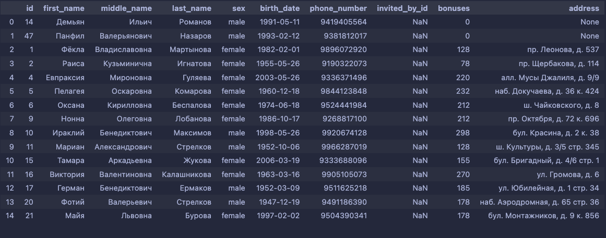


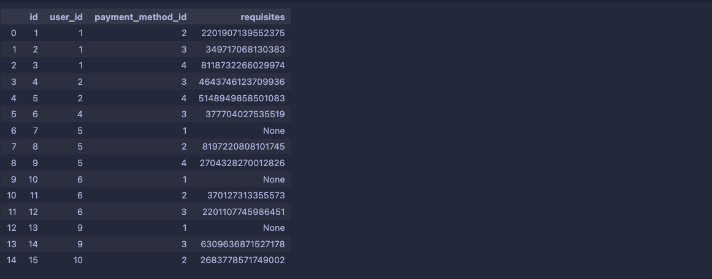


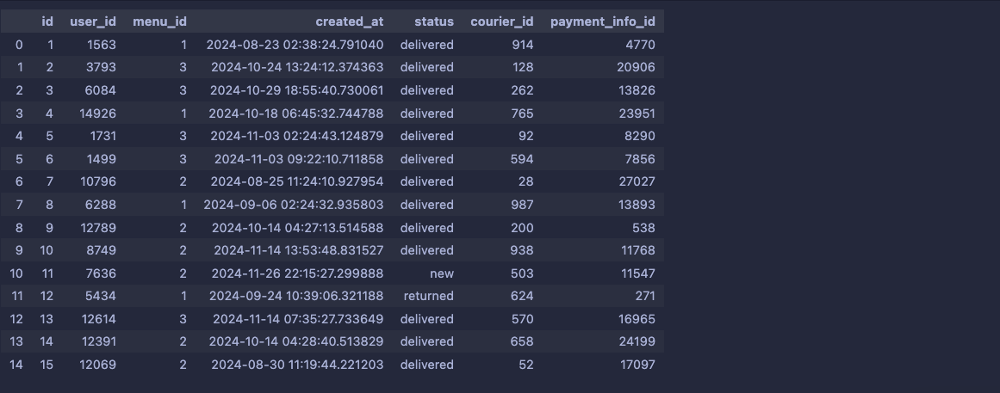

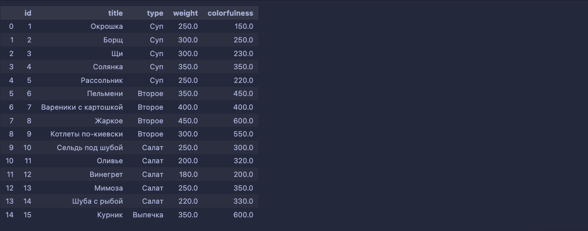


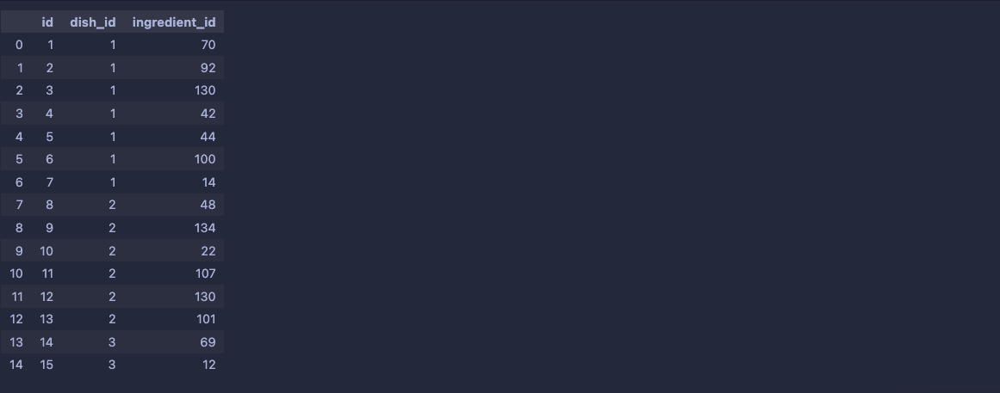


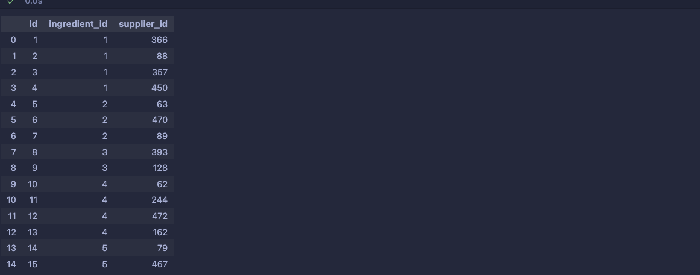


# Выполнение запросов

В этом разделе приведены различные запросы к реализованной базе данных: их краткие описания, непосредственно запрос на языке SQL и результат выполнения.

1. Найти выручку сервиса за последний месяц.

```sql
WITH
    orders_last_month AS (
        SELECT
            *
        FROM
            orders
        WHERE
            created_at >= CURRENT_DATE - INTERVAL '1 month'
    )

SELECT
    SUM(m.cost) AS Выручка
FROM
    orders_last_month AS o
    INNER JOIN menus AS m on o.menu_id = m.id
```


2. Какая доля (в `%`) общей выручки приходится на меню с названием «Похудение»? Проценты округлить до двух знаков после запятой.

```sql
SELECT 
    ROUND(
        SUM(m.cost) FILTER (WHERE m.title = 'Похудение')::DECIMAL / 
        SUM(m.cost)::DECIMAL * 100, 2) AS losing_weight_revenue_ratio
FROM
    orders AS o
    INNER JOIN menus AS m on o.menu_id = m.id
```


3. Вычислить НДС каждого меню и рассчитать цену каждого меню не включая НДС. Вывести название меню, его текущую цену, НДС и цену без НДС. Значения округлить до двух знаков после запятой.

```sql
SELECT 
    title, 
    cost,
    ROUND(cost::DECIMAL / 1.2 * 0.2, 2) AS tax,
    ROUND(cost::DECIMAL / 1.2, 2) AS cost_before_tax
FROM
    menus
```


4. Найти заказы, которые оказались возвращены и были оплачены с помощью «Яндекс.Сплит». Вывести `id` заказа, дату заказа и реквизиты платежа.

```sql
WITH
    yandex_split_payments AS (
        SELECT
            i.*
        FROM
            payment_infos i
            JOIN payment_methods m ON i.payment_method_id = m.id
        WHERE
            m.title = 'Яндекс.Сплит'
    )

SELECT
    o.id AS order_id,
    DATE(o.created_at) AS order_created_at,
    p.requisites AS requisites
FROM
    orders o
    JOIN yandex_split_payments p ON o.payment_info_id = p.id
WHERE
    o.status = 'returned'
```


5. Найти топ-5 пользователей по количеству бонусов, которые большинство своих заказов оплатили наличными курьеру. Вывести `id` пользователя, его имя и количество бонусов.

```sql
WITH
    payment_infos_and_methods AS (
        SELECT
            i.id AS payment_info_id,
            m.title AS payment_method
        FROM
            payment_infos i
            JOIN payment_methods m ON i.payment_method_id = m.id
    ),
    user_method_counts AS (
        SELECT
            o.user_id,
            p.payment_method,
            COUNT(o.id) AS orders_count
        FROM
            orders o
            JOIN payment_infos_and_methods p USING (payment_info_id)
        GROUP BY
            o.user_id,
            p.payment_method
    ),
    user_method_counts_with_total AS (
        SELECT
            *,
            SUM(orders_count) OVER (
                PARTITION BY
                    user_id
            ) AS total_orders_count
        FROM
            user_method_counts
    ),
    users_with_almost_cash_orders AS (
        SELECT
            user_id AS id
        FROM
            user_method_counts_with_total
        WHERE
            payment_method = 'Наличные курьеру'
            AND orders_count > total_orders_count / 2
    )

SELECT
    u.id,
    CONCAT(u.first_name, ' ', u.middle_name, ' ', u.last_name) AS name,
    u.bonuses
FROM
    users u
    JOIN users_with_almost_cash_orders u_cash USING (id)
ORDER BY
    u.bonuses DESC
LIMIT
    5;
```


6. Найти блюда, содержащие хотя бы один ингредиент, который относится к самой популярной категории предпочтений. Вывести только названия блюд, отсортированные в алфавитном порядке.

```sql
WITH
    most_popular_category AS (
        SELECT
            preference_category_id,
            COUNT(pu.id) AS count
        FROM
            preferences_users pu
            JOIN preferences p ON pu.preference_id = p.id
        GROUP BY
            preference_category_id
        ORDER BY
            count DESC
        LIMIT
            1
    ),
    preferences_from_most_popular_category AS (
        SELECT
            id,
            title
        FROM
            preferences
        WHERE
            preference_category_id = (
                SELECT
                    preference_category_id
                FROM
                    most_popular_category
            )
    ),
    ingredients_from_most_popular_category AS (
        SELECT
            ip.ingredient_id
        FROM
            ingredients_preferences ip
        JOIN preferences_from_most_popular_category p ON ip.preference_id = p.id
    )

SELECT
    DISTINCT d.title
FROM
    dishes_ingredients
    JOIN ingredients_from_most_popular_category i ON dishes_ingredients.ingredient_id = i.ingredient_id
    JOIN dishes d ON dishes_ingredients.dish_id = d.id
ORDER BY
    d.title;
```

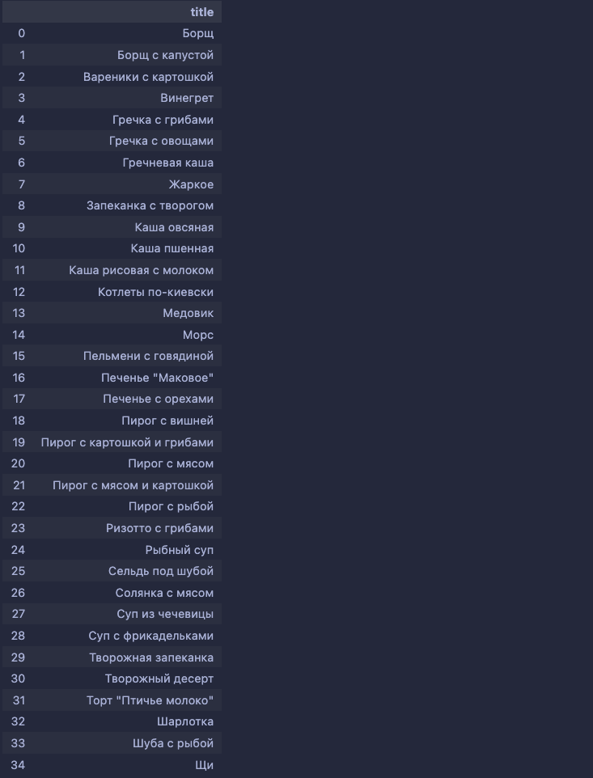

7. Вывести 2 строки с названием меню, массивом входящих в него блюд и даты, которые принесут больше всего прибыли (численно и в % относительно себестоимости).

Пусть блюдо состоит из ингридиентов $x_1, x_2, \ldots, x_n$. Закупочная стоимость каждого ингридиента равна $c_1, c_2, \ldots, c_n$ соответственно. Тогда я предполагаю, что себестоимость блюда равна $p = \sum_{i=1}^n c_i$ (я не учитываю, что блюдо содержит $a$ грамм данного ингридиента).

Пусть меню на конкретный день состоит из блюд $y_1, y_2, \ldots, y_m$. Тогда себестоимость меню будет равна $P = \sum_{j=1}^m p_j$.

Розничная цена на данное меню равна $S$. Тогда прибыль от данного меню равна $S - P$. Будем находить 2 меню: с наибольшим значением $S - P$ и с наибольшим значением $\frac{S - P}{P}$.

Заметим, что цена ингредиента указана в долларах, а цена меню в рублях. Поэтому для вычисления прибыли нужно умножить цену ингредиента на курс доллара. Курс доллара принять равным 1 доллар = 7.55 рублей (поправка на нереалистичную заполненность базы данных и предположение о составе блюда).

```sql
WITH
    ingredients_costs_in_rubles AS (
        SELECT
            id,
            cost * 7.55 AS cost_rubles
        FROM
            ingredients
    ),
    dishes_costs AS (
        SELECT
            d.dish_id AS id,
            SUM(i.cost_rubles) AS cost
        FROM
            dishes_ingredients d
            JOIN ingredients_costs_in_rubles i ON d.ingredient_id = i.id
        GROUP BY
            d.dish_id
    ),
    menus_costs_and_dishes AS (
        SELECT
            menu_id,
            m.date,
            SUM(cost) AS our_cost,
            ARRAY_AGG(dish_id) AS dishes
        FROM
            dishes_menus m
            JOIN dishes_costs c ON m.dish_id = c.id
        GROUP BY
            menu_id,
            m.date
        ORDER BY
            m.date,
            menu_id
    ),
    menus_profits AS (
        SELECT
            mc.*,
            m.cost,
            ROUND((m.cost - mc.our_cost)::DECIMAL, 2) AS profit,
            ROUND((m.cost - mc.our_cost)::DECIMAL / mc.our_cost::DECIMAL * 100, 2) AS profit_percent
        FROM
            menus_costs_and_dishes mc
            JOIN menus m ON mc.menu_id = m.id
    ),
    max_profit AS (
        SELECT
            menu_id,
            date,
            dishes,
            profit,
            profit_percent
        FROM
            menus_profits
        ORDER BY
            profit_percent DESC
        LIMIT 1
    ),
    max_profit_percent AS (
        SELECT
            menu_id,
            date,
            dishes,
            profit,
            profit_percent
        FROM
            menus_profits
        ORDER BY
            profit DESC
        LIMIT 1
    )

SELECT * FROM max_profit UNION ALL SELECT * FROM max_profit_percent;
```


8. Какие пары блюд находятся вместе в меню чаще всего? Вывести их названия и количество нахождений вместе.

```sql
WITH 
    max_count_pair AS (
        SELECT DISTINCT
            ARRAY[dm1.dish_id, dm2.dish_id] AS pair,
            COUNT(*) AS count
        FROM
            dishes_menus dm1 JOIN dishes_menus dm2 USING(menu_id, date)
        WHERE 
            dm1.dish_id < dm2.dish_id
        GROUP BY
            pair
        ORDER BY
            count DESC
        LIMIT 1
    )

SELECT
    d1.title AS dish1,
    d2.title AS dish2,
    count
FROM
    max_count_pair 
    JOIN dishes d1 ON pair[1] = d1.id
    JOIN dishes d2 ON pair[2] = d2.id
```


9.  Найти медианное количество заказов у пользователей.
    
если количество строк чётное, то медиана - это среднее двух средних значений. Если количество строк нечётное, то медиана - это значение в середине.

Если всего строк чётное количество, то `total_rows / 2` и `total_rows / 2 + 1` - целые числа, на выходе будет две строки и среднее арифметическое возьмётся от двух значений.

Если всего строк нечётное количество, то `total_rows / 2` и `total_rows / 2 + 1` - нецелые числа, на выходе будет одна строка и это и будет медиана.

```sql
WITH
    main_table AS (
        SELECT
            u.id,
            COUNT(o.id) AS orders_count
        FROM
            users u
            JOIN orders o ON u.id = o.user_id
        GROUP BY
            u.id
        ORDER BY
            orders_count ASC
    ),
    series AS (
        SELECT
            orders_count,
            ROW_NUMBER() OVER (
                ORDER BY
                    orders_count
            ) AS row_number,
            COUNT(*) OVER () AS total_rows
        FROM
            main_table
    )

SELECT
    AVG(orders_count) AS median_count
FROM
    series
WHERE
    row_number BETWEEN total_rows / 2.0 AND total_rows  / 2.0 + 1
```


10. Рассчитать ежедневную выручку сервиса, рассчитать ежедневный прирост выручки (численно и в %) относительно предыдущего дня.
    
```sql
WITH
    main_table AS (
        SELECT
            DATE (o.created_at) AS date,
            SUM(m.cost) AS revenue
        FROM
            orders o
            JOIN menus m ON o.menu_id = m.id
        GROUP BY
            DATE (o.created_at)
        ORDER BY
            date
    )

SELECT
    date,
    revenue,
    (revenue - LAG (revenue, 1) OVER ()) AS revenue_growth_abs,
    ROUND(100 * (revenue - LAG (revenue, 1) OVER ())::DECIMAL / LAG (revenue, 1) OVER ()::DECIMAL, 2) AS revenue_growth_rate
FROM
    main_table
```


11. Построить иерархию приглашенных и пригласивших пользователей.

```sql
WITH RECURSIVE
    users_tree AS (
        SELECT
            id,
            CONCAT (first_name, ' ', middle_name, ' ', last_name) AS full_name,
            invited_by_id AS parent_id,
            1 AS level
        FROM
            users
        WHERE
            invited_by_id IS NULL
        UNION ALL
        SELECT
            u.id,
            CONCAT (first_name, ' ', middle_name, ' ', last_name) AS full_name,
            invited_by_id AS parent_id,
            ut.level + 1
        FROM
            users u
            JOIN users_tree ut ON u.invited_by_id = ut.id
    )

SELECT
    *
FROM
    users_tree

```

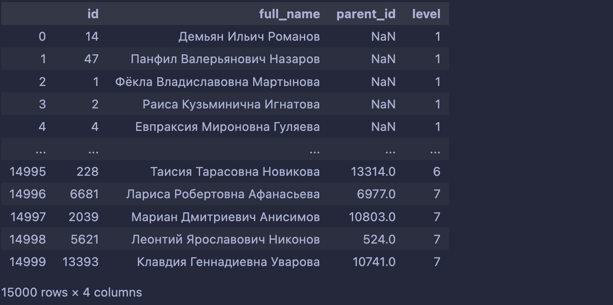

12. Пусть сегодня 1 число какого-то месяца. У нас есть список заказов за предыдущий месяц. В предположении, что количество заказов на каждую позицию в меню останется таким же, вывести список ингредиентов, для которых следует нанять ещё поставщиков (которых не хватит для изготовления нужных блюд на ближайший месяц). Рассчитывать со следующим допущением: если блюдо весит $a$ грамм и для его изготовления нужно $n$ ингредиентов, то каждого ингредиента нужно в количестве $\frac{a}{n}$ грамм.

```sql
WITH
    orders_last_month AS (
        SELECT
            menu_id,
            date (created_at) AS date,
            COUNT(*) AS orders_count
        FROM
            orders
        WHERE
            date (created_at) + INTERVAL '1 day' BETWEEN CURRENT_DATE - INTERVAL '1 month' AND CURRENT_DATE
        GROUP BY
            date (created_at),
            menu_id
    ),
    dishes_count AS (
        SELECT
            dish_id,
            SUM(orders_count) AS count
        FROM
            orders_last_month o
            JOIN dishes_menus dm ON o.menu_id = dm.menu_id
            AND o.date + INTERVAL '1 month 1 day' = dm.date
        GROUP BY
            dish_id
    ),
    dishes_ingredients_with_weights AS (
        SELECT
            dish_id,
            ingredient_id,
            weight::DECIMAL / COUNT(*) OVER (PARTITION BY dish_id)::DECIMAL AS ingredients_weight
        FROM
            dishes_ingredients AS di
            JOIN dishes AS d ON di.dish_id = d.id
    ),
    ingredients_total_weight AS (
        SELECT
            ingredient_id,
            SUM(ingredients_weight * count) AS total_weight
        FROM
            dishes_ingredients_with_weights AS weights
            JOIN dishes_count AS counts USING (dish_id)
        GROUP BY
            ingredient_id
    ),
    ingredients_productivity AS (
        SELECT
            ingredient_id,
            SUM(productivity) AS productivity
        FROM
            ingredients_suppliers AS ins
            JOIN suppliers s ON ins.supplier_id = s.id
        GROUP BY
            ingredient_id
    )

SELECT
    ingredient_id
FROM
    ingredients_total_weight AS itw
    JOIN ingredients_productivity AS ip USING (ingredient_id)
WHERE
    productivity * 1000 >= total_weight
ORDER BY
    ingredient_id
```

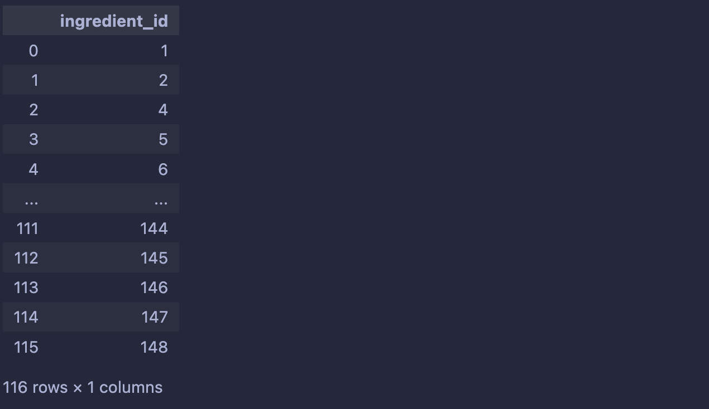

